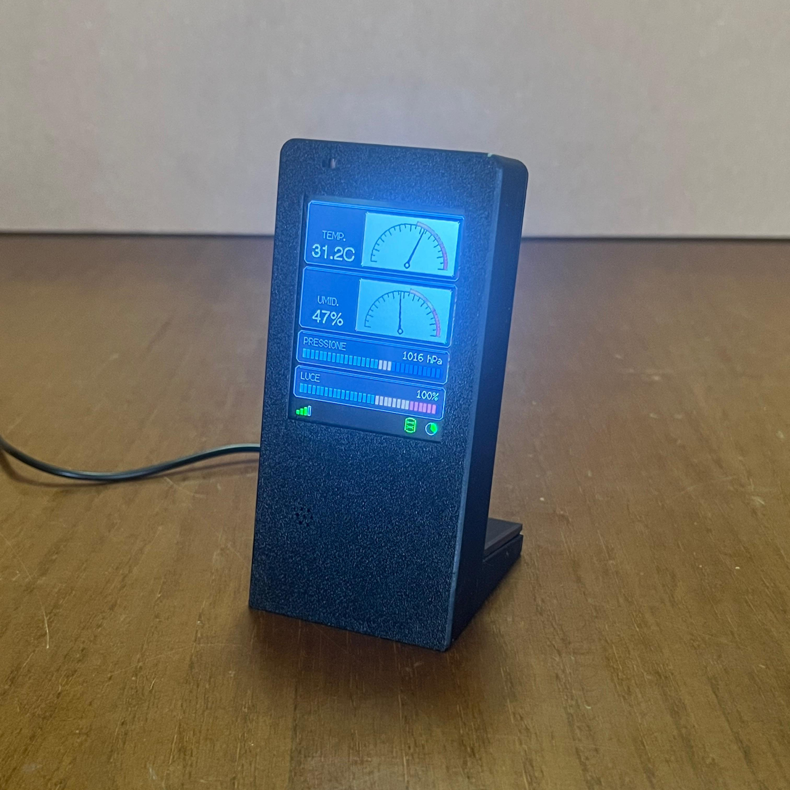

# CYD - BME280 · Stazione ambientale

Stazione ambientale da scrivania basata su **CYD (ESP32-2432S028)** con display
ILI9341 240×320 e sensore **BME280**. Mostra **temperatura** e **umidità** come
VU-meter a lancetta, **pressione** e **luce ambientale** come slider a LED. Ogni
minuto invia le misure via WiFi a un backend PHP che le salva su MySQL e le
pubblica su una **dashboard web** con grafici storici. Progetto **didattico**:
`main.cpp` e i file `server/` sono commentati riga per riga.



## Hardware
- **CYD** ESP32-2432S028 — display ILI9341 240×320, touch XPT2046, LDR integrata (GPIO34).
- **BME280** su I²C: `SDA = GPIO27`, `SCL = GPIO22`, indirizzo 0x76 (fallback 0x77).
- **Touch XPT2046** su bus SPI dedicato (CLK=25, MOSI=32, MISO=39, CS=33, IRQ=36).
- Alimentazione USB.

## Firmware (PlatformIO)
1. Apri il progetto con **PlatformIO** (env `esp32dev`). Le librerie sono in `platformio.ini`.
2. Crea il file dei segreti e inserisci le tue credenziali:
   ```
   cp src/secrets.example.h src/secrets.h
   ```
   Poi in `src/secrets.h`: `WIFI_SSID`, `WIFI_PASS`, `DB_ENDPOINT`, `DB_TOKEN`.
   > `secrets.h` è in `.gitignore`: le credenziali reali non finiscono mai nel repo.
3. Compila e carica sulla CYD.

La configurazione del display è tutta nei `build_flags` di `platformio.ini`
(niente `User_Setup.h`). Nota: questo pannello rende i colori scambiati e con
bianco/nero invertiti — nel codice si usano sempre le macro `COL_*` / l'helper
`rgb()`, mai le costanti `TFT_*` grezze. Vedi `CLAUDE.md` per i dettagli tecnici.

## Backend + dashboard (`server/`)
Da caricare sul proprio spazio web (es. Aruba), nella stessa cartella:
- `insert.php` — riceve le POST dall'ESP32 (protette da token) e scrive su MySQL.
- `data.php` — API di sola lettura (JSON) per la dashboard.
- `index.html` — dashboard Chart.js: valori attuali + 4 grafici storici
  (temp/umidità/pressione/luce), selettore intervallo, riferimento pressione per
  altitudine, gestione dei buchi nei dati.
- `schema.sql` — struttura della tabella. `favicon.svg` — icona.

Le credenziali DB e il token stanno in `server/secrets.php` (fuori dal repo):
copia `server/secrets.example.php` in `secrets.php`, compila i valori e imposta
`$SECRET` uguale al `DB_TOKEN` del firmware. Dettagli in `server/README.md`.

## Case 3D (`cad/`)
Case stampabile in due pezzi (`Fronte.stl` + `Retro.stl`, o il progetto già
affettato `Meteo.3mf`). Profilo **Bambu Lab A1 mini**, PETG, layer 0.2, infill 15%.
Display e sensore si fissano con **viti M2 × 5 mm**.

📥 **Modello 3D su MakerWorld** (CC BY 4.0):
https://makerworld.com/en/models/3038452-weather-station-case-cyd-esp32-2432s028-bme280

Testi del listing in `cad/MAKERWORLD_LISTING.md`.

## Roadmap
- Pilotaggio di **attuatori esterni** (ventilatore, luce) via relè/MOSFET.
- **Automazioni a soglia** su temperatura e luce, con comando manuale dal touchscreen.

## Licenza
Tutto il progetto — modello 3D (`cad/`), firmware, backend e documentazione — è
rilasciato sotto **Creative Commons Attribution 4.0 International (CC BY 4.0)**:
sei libero di usarlo, modificarlo e ridistribuirlo, anche a fini commerciali,
**citando l'autore** (Giuseppe Minniti). Vedi il file [`LICENSE`](LICENSE). Coerente
con la licenza scelta per il modello su MakerWorld.

## Ringraziamenti

Ideazione, progettazione, scelte tecniche, prove sul campo e cura del risultato
finale sono di **Giuseppe Minniti**. Parte dello sviluppo è stata portata avanti
in **collaborazione con un assistente AI (Claude, di Anthropic)**, usato come
compagno di lavoro: per confrontare idee, scrivere e commentare codice, rifinire
la documentazione.

Mi piace pensarla come una collaborazione in cui si cresce a vicenda: l'AI non
sostituisce il lavoro e le decisioni umane, le affianca e le accelera. La
direzione, il senso critico e la responsabilità delle scelte restano di chi
progetta — e proprio da questo dialogo nasce l'occasione di imparare, per
entrambe le parti.
